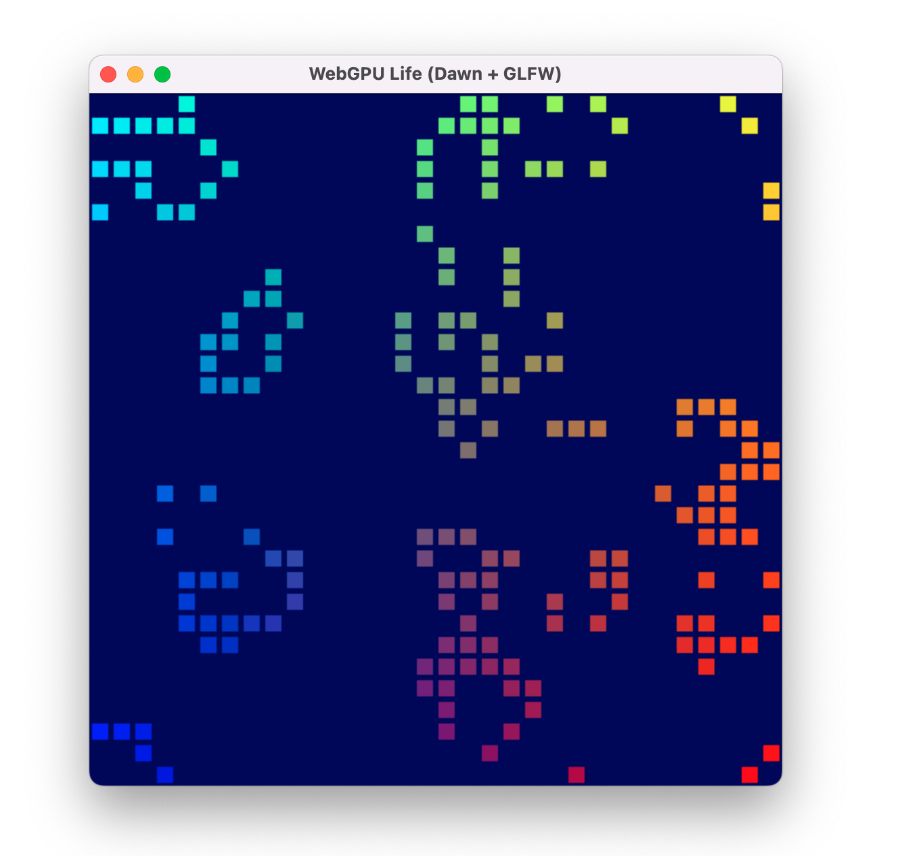
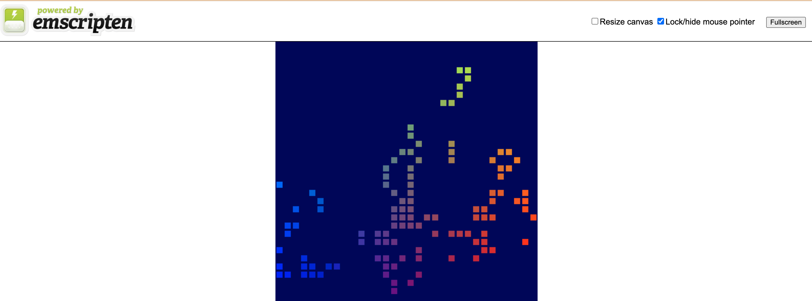

# WebGPU cross-platform app with CMake/Emscripten


# Extensions in this fork

This project is based on the excellent work by beaufortfrancois (see original repository), which provided the foundation for a minimalistic C++ example showing how to use WebGPU to build desktop and web apps from a single codebase. That implementation demonstrates WebGPU’s webgpu.h through the C++ wrapper webgpu_cpp.h.

On the web, the app is built against Emdawnwebgpu (Emscripten Dawn WebGPU), which maps WebGPU calls onto the browser’s JavaScript API. It uses Emscripten to compile C/C++ to WebAssembly. On platforms such as macOS or Windows, the app instead targets Dawn, Chromium’s cross-platform WebGPU implementation.

### Desktop Results



### Web WebAssembly/WebGPU Results



In addition to the base example, this fork extends the demo into a fully interactive version of Conway’s Game of Life:

- Mouse interaction:
- Left-click turns a cell on (alive).
- Right-click turns a cell off (dead).
- Pointer updates write directly into the storage buffers, so edits are reflected immediately in the simulation.

This interactivity builds on the original JavaScript tutorial, which you can find linked in the credits below.

## Credits

- [beaufortfrancois/webgpu-cross-platform-app](https://github.com/beaufortfrancois/webgpu-cross-platform-app) — Original cross-platform C++ WebGPU example that this project is built upon (setups up a pipeline to render a single static triangle).
- [Your first WebGPU app (Google Codelab)](https://codelabs.developers.google.com/your-first-webgpu-app#0) — Original JavaScript tutorial for Conway’s Game of Life, which inspired the port to C++ with Dawn.

## Setup

```sh
# Clone repository and initialize submodules.
git clone https://github.com/beaufortfrancois/webgpu-cross-platform-app.git
cd webgpu-cross-platform-app/
git submodule update --init
```

## Requirements

<i>Instructions are for **macOS**; they will need to be adapted to work on Linux and Windows.</i>

```sh
# Make sure CMake and Emscripten are installed.
brew install cmake emscripten
```

## Specific platform build

```sh
# Build the app with CMake.
cmake -B build && cmake --build build -j4

# Run the app.
./build/app
```

## Web build

```sh
# Build the app with Emscripten.
emcmake cmake -B build-web && cmake --build build-web -j4

# Run a server.
npx http-server
```

```sh
# Open the web app.
open http://127.0.0.1:8080/build-web/app.html
```

### Debugging WebAssembly

When building the app, compile it with DWARF debug information included thanks to `emcmake cmake -DCMAKE_BUILD_TYPE=Debug -B build-web`. And make sure to install the [C/C++ DevTools Support (DWARF) Chrome extension](https://goo.gle/wasm-debugging-extension) to enable WebAssembly debugging in DevTools.


